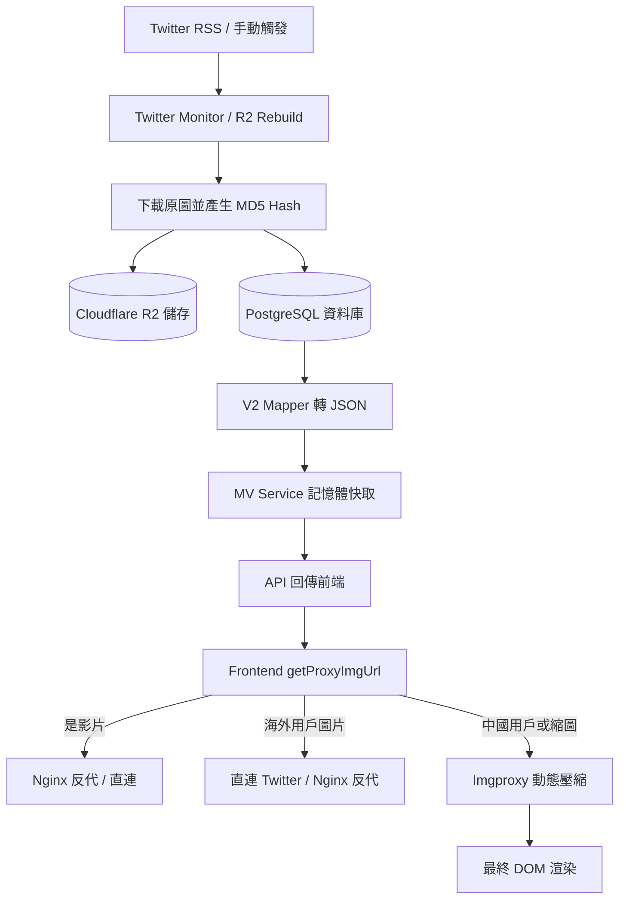

# ZUTOMAYO Gallery 媒體資源全鏈路解析 (Media Flow)

本文檔完整記錄了 ZUTOMAYO Gallery 專案中圖片與影片資源從「源頭獲取」、「入庫儲存」、「後端查詢」到「前端展示」的完整生命週期與決策邏輯。
本文件設計為易於人類閱讀與修改，同時保持結構化以便 AI 快速理解系統架構。

---

## 1. 源頭獲取與自動化入庫 (Source & Ingestion)

資源的來源主要分為「自動監控」與「手動同步」兩種，最終皆統一無損備份至 Cloudflare R2。

### 1.1 自動化 Twitter 監控 (Twitter Monitor)
- **觸發機制**：後端透過 `node-cron` 定時解析 Twitter RSS (由 `TWITTER_RSS_URL` 提供)。
- **處理流程**：
  1. **解析推文**：透過 `TwitterService.extractMediaFromTweet` 提取推文中的圖片/影片真實網址。
  2. **備份至 R2**：呼叫 `backupImageToR2` 下載最高畫質媒體 (`?name=orig`) 並上傳至 R2 (`zutomayo-gallery-archive` Bucket)。
  3. **寫入資料庫**：將推文資訊存入 `media_groups` (狀態設為 `unorganized`)，並將媒體存入 `media` 表。
  4. **通知管理員**：若設定了 `BARK_URL`，則發送 Bark 推播通知。
- **程式碼參考**：[twitter-monitor.service.ts](file:///Users/lyangjyehaur/Projects/zutomayo-gallery/backend/src/services/twitter-monitor.service.ts)

### 1.2 管理員手動同步/重建 (R2 Rebuild)
- **觸發機制**：管理員在後台執行「同步至 R2」。
- **處理流程**：
  1. 遍歷資料庫中所有 MV (`mvs`) 與已整理的二創 (`media_groups` status: `organized`)。
  2. 檢查其 `original_url` (如 `pbs.twimg.com`)，重新抓取原圖。
  3. 將 `url` 欄位替換為 Cloudflare R2 網址 (`https://r2.dan.tw/...`)，並更新資料庫。
- **程式碼參考**：[r2_rebuild.ts](file:///Users/lyangjyehaur/Projects/zutomayo-gallery/backend/src/controllers/r2_rebuild.ts)

---

## 2. 儲存層與資料庫模型 (Storage & DB Schema)

### 2.1 Cloudflare R2 物件儲存
- **命名規則**：根據原始網址計算 MD5 Hash，結合副檔名生成，例如 `fanarts/<hash>.jpg` 或 `mvs/<mv_id>/<hash>.mp4`。
- **Metadata 附加**：上傳時會附帶 `original-url`, `mv-id`, `fanart-id` 等自訂 Metadata，作為未來的備用資料庫。
- **程式碼參考**：[r2.service.ts](file:///Users/lyangjyehaur/Projects/zutomayo-gallery/backend/src/services/r2.service.ts)

### 2.2 PostgreSQL 關聯式資料庫 (V2 Schema)
- **`mvs`**：MV 核心資料表。
- **`media`**：統一媒體表，儲存所有圖片/影片的 `url` (R2 網址) 與 `original_url` (原始網址)。
- **`media_groups`**：媒體分組，用於綁定同一篇推文來源的多張圖片，紀錄作者與來源連結。
- **`mv_media`**：中繼表 (Junction Table)，定義特定圖片在特定 MV 中的角色 (`usage`: cover/gallery) 與排序 (`order_index`)。
- **程式碼參考**：[DB_SCHEMA.md](file:///Users/lyangjyehaur/Projects/zutomayo-gallery/docs/DB_SCHEMA.md)

---

## 3. 後端數據處理與 API (Backend API & Services)

後端在提供資料給前端時，會進行格式轉換與快取。

### 3.1 V2 Mapper 結構轉換
- **查詢邏輯**：從關聯式資料庫中 JOIN `artists`, `albums`, `keywords`, `media` 等表。
- **降維處理**：為了相容前端期望的 V1 JSON 結構，將關聯資料扁平化，將 `MVMedia` 的 `usage` 與 `order_index` 注入到圖片物件中。
- **程式碼參考**：[v2_mapper.ts](file:///Users/lyangjyehaur/Projects/zutomayo-gallery/backend/src/services/v2_mapper.ts)

### 3.2 內存快取與搜尋引擎
- **Runtime Data**：為了極致的 API 響應速度，後端啟動時會將資料載入記憶體 (`runtimeData`)。
- **Meilisearch 整合**：前端搜尋關鍵字時，若環境啟用 Meilisearch，則透過 Meilisearch 進行全文檢索並返回相關度排序的 ID 陣列，再從記憶體快取中過濾出完整資料。
- **程式碼參考**：[mv.service.ts](file:///Users/lyangjyehaur/Projects/zutomayo-gallery/backend/src/services/mv.service.ts)

---

## 4. 前端展示與網路狀態分流引擎 (Frontend Display & Network Routing)

這是整個架構中最複雜且最核心的部分，主要位於 `image.ts` 中的 `getProxyImgUrl` 函數。它負責解決「牆 (GFW)」、「伺服器效能 (CPU/頻寬)」與「下載體驗」三大問題。

### 4.1 核心路由與模組化設計：`image.ts`
為了解決複雜的網路決策與網址轉換問題，前端將圖片處理邏輯拆分為四個職責明確的函數：

1. **`buildImgproxyUrl(targetUrl, mode, customFilename)`**：
   - 專責處理 Imgproxy 網址生成。
   - 負責將網址 Base64 編碼，附加壓縮參數 (`w:402/f:webp` 等) 或下載參數 (`raw:1/filename:XXX`)。
   - 處理安全簽名機制 (若有設定 `SALT/KEY`)，將請求導向後端 API 代理 `/api/system/image/proxy`。
2. **`formatTwitterImageUrl(url, mode)`**：
   - 專責處理推特圖片的網址清理與尺寸參數附加。
   - 移除舊的 `?format=jpg&name=small` 查詢參數，並依據 `mode` 自動加上正確的 `name=large`、`name=orig` 等參數，確保不產生疊加衝突。
3. **`formatYoutubeImageUrl(url, mode)`**：
   - 專責處理 YouTube 封面的動態畫質降級。
   - 因為 YouTube 封面不存在讓使用者「下載原圖」的需求，且作為 modal 播放器背景圖片 (`full` 模式) 時，標準畫質 `sddefault.jpg` (640x480) 的清晰度已經足夠。因此只要是 `full` 或 `small` 模式，都會自動將最高畫質降級為 `sd`。
   - 若為首頁瀑布流小圖 (`thumb`)，則進一步降級為 `hqdefault.jpg` (480x360)，這個尺寸對於卡片列表已經非常清晰且能大幅提升載入速度。
4. **`getProxyImgUrl(rawUrl, mode, customFilename)`**：
   - 這是所有圖片與影片在進入 DOM (`` / `<video>`) 之前，**必須**經過的總決策函數。
   - 專注於高層級的「網路路由決策」，依據 `getGeoInfo()` 判斷訪客 IP、媒體類型與請求模式，呼叫前述三個函數或直接替換網域。
- **`mode` 參數定義**：
  - `thumb`：瀑布流小圖 (約 400px WebP)
  - `small`：中等縮圖 (約 600px WebP)
  - `full`：燈箱展示大圖 (原解析度 WebP，或直連原圖)
  - `raw`：下載模式 (無損原圖，附帶自訂檔名)

### 4.2 核心網路分流策略 (Network Routing Strategy)

系統透過 `getGeoInfo()` 判斷訪客 IP，並結合「資源來源」、「媒體類型(圖/影)」與「請求模式(mode)」，實作了極致的效能與免翻牆優化：

#### 📍 全局優先策略：優先載入原圖 (Global Direct First)
**目標：極大化利用原始資源伺服器 (如推特)，盡量節省我方 R2 的流量與 Imgproxy 算力**
*註：系統若偵測到用戶 IP 雖在中國大陸但時區不符 (判定為 VPN 翻牆)，則視同海外用戶，直接讓其代理客戶端處理直連流量，省下我方反代伺服器負擔。*
- **不分海內外**：前端組件 (如 `FancyboxViewer`) 渲染圖片時，會優先檢查資料庫是否保留了 `original_url` (推特或 YouTube 原始網址)。
- 若存在，則將 `original_url` 交給 `getProxyImgUrl` 處理：
  - **海外/翻牆用戶**：直連 `pbs.twimg.com`，完全不消耗我方資源。
  - **大陸用戶**：替換為 Nginx 反代 `assets.ztmr.club/ti` 穿透 GFW。這裡的巧妙之處在於，依然利用 Twitter 原生的 `?name=small/large` 參數來獲取官方縮圖，**刻意繞過 Imgproxy**，從而大幅節省圖片重新壓縮的 CPU 消耗。
- **優雅降級 (Fallback)**：只有當 Twitter/YouTube 上的圖片因刪除等原因失效 (觸發 `onError`) 時，前端才會退回並載入 R2 上的備份圖 (`img.url`)。

#### 📍 特殊狀態：原圖下載模式 (Raw Download)
**目標：確保無損畫質，並注入友善的自訂檔名**
- **不分海內外**：只要使用者點擊下載 (`mode === 'raw'`) 圖片，**一律呼叫 `buildImgproxyUrl` 交給 Imgproxy 處理**。
- **底層原因**：雖然海外用戶直連 Twitter (`?name=orig`) 也能拿到原圖，但這樣下載下來的檔案名稱會是 Twitter 隨機產生的亂碼 (如 `E1F2g3H4.jpg`)，R2 也會是 MD5 Hash。Imgproxy 在此模式下不對圖片進行壓縮 (`raw:1`)，但會透過 HTTP Header 注入 `Content-Disposition: attachment; filename="自訂檔名.jpg"`。這樣訪客下載時，就能自動獲得如 `勘冴えて悔しいわ_1.jpg` 這種具備語義的檔名。

#### 📍 當降級到 R2 備份圖時的處理邏輯
如果原圖失效，或者資料庫中本來就只有 R2 網址：
- **不分海內外 (Global IP)**：
  - 大圖/影片展示 (`full` / `video`)：**完全直連 Cloudflare R2 (`r2.dan.tw`)**。由於 R2 綁定的自訂網域本身就已經在 Cloudflare CDN 後方，中國大陸的 GFW 並沒有封鎖它。因此不論海內外用戶直連 R2 網域，不僅速度最快，也完全不消耗我方伺服器的頻寬與 Nginx 效能。
  - 縮圖展示 (`thumb/small`)：因為 R2 內只有 10MB 的原圖，為了避免瀑布流載入過大檔案，此時會**呼叫 `buildImgproxyUrl` 強制進入 Imgproxy** 即時壓縮成 WebP 縮圖。

### 4.3 Imgproxy 動態影像處理與安全機制
- **縮圖生成**：將 R2 中的高畫質原圖，即時壓縮成 WebP 縮圖 (`w:302/402/602/f:webp`)。
- **下載檔名注入**：在 `raw` 模式下，透過 `filename:XXX` 參數，在 HTTP 回應中注入 `Content-Disposition: attachment; filename="XXX.jpg"`，讓瀏覽器下載時自動使用友好的自訂檔名 (例如 `勘冴えて悔しいわ_1.jpg`)，而非 R2 上的 MD5 Hash 亂碼。
- **安全簽名**：若設定了 `IMGPROXY_KEY`，前端不會直接暴露 imgproxy 網址，而是指向後端 API `/api/system/image/proxy`，由後端生成簽名後 302 重定向，防止伺服器被惡意消耗算力。

### 4.4 異常處理與降級 (Fallback)
- **SVG 佔位圖**：當圖片因網路問題載入失敗 (`onError`) 時，會自動替換為極輕量的 Base64 SVG 骨架圖。
- **DOM 防呆**：前端元件會在 `` 標籤上備妥完整的 `alt` 屬性，避免 `imgproxy` 處理失敗時畫面破版。

## 5. 本地開發與網路狀態模擬 (Debug & Testing)

為了方便開發者在本地環境或線上測試不同國家 IP 的分流策略，系統在 `geo.ts` 中實作了隱藏的 Debug 後門。你可以透過瀏覽器的開發者工具 (Console) 注入特定變數來強制模擬網路狀態。

### 5.1 強制模擬地理位置
在瀏覽器 Console 輸入以下指令，並**重新整理頁面 (F5)** 即可生效：

```javascript
// 1. 模擬中國大陸用戶 (Mainland China) - 強制走 Nginx 反代與 Imgproxy
localStorage.setItem('mock_geo_mode', 'CN');

// 2. 模擬海外用戶 (Global) - 強制直連推特原圖與 R2 CDN
localStorage.setItem('mock_geo_mode', 'GLOBAL');

// 3. 模擬翻牆用戶 (VPN) - IP 在海外但時區在中國，將被視同 GLOBAL 享受直連優化
localStorage.setItem('mock_geo_mode', 'VPN');

// 4. 清除模擬，恢復真實 IP 偵測
localStorage.removeItem('mock_geo_mode');
```

### 5.2 舊版相容性 Debug
如果你需要強制讓 `getProxyImgUrl` 函數不論是否在海外，都執行中國大陸的反代邏輯（例如測試反代節點是否正常運作），可以使用：
```javascript
// 強制關閉海外直連優化 (將 isOverseasDirect 設為 false)
localStorage.setItem('is_china', 'true');

// 恢復正常
localStorage.removeItem('is_china');
```

---

## 6. 總結流程圖



---

### ⚠️ R2 CORS 設定 (重要)
為了讓前端 Fancybox 能夠無障礙地跨域載入圖片與影片（並支援縮放與手勢操作），必須在 Cloudflare R2 的「CORS 原則」中加入以下設定：

```json
[
  {
    "AllowedOrigins": [
      "http://localhost:5173",
      "https://*.ztmr.club",
      "https://ztmr.club"
    ],
    "AllowedMethods": [
      "GET",
      "HEAD"
    ],
    "AllowedHeaders": [
      "*"
    ],
    "MaxAgeSeconds": 86400
  }
]
```
*這將允許本地開發環境與正式網域無縫存取 R2 資源。*
